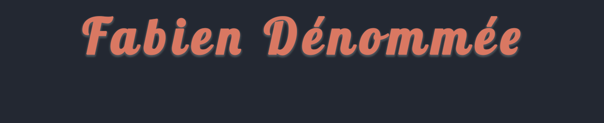

## **Hello World!** 
I am Fabien Dénommée, a passionate full-stack developer who loves to create elegant and responsive designs. I'm constantly striving to learn new things. I'm currently on the lookout for new opportunities to apply my skills and contribute to exciting projects.

If you'd like to learn more about me, feel free to look my  [portfolio](https://fabdeveloper.netlify.app/ "Fabien's Portfolio").
## **:computer:Languages**
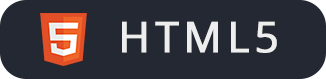 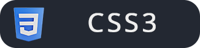 
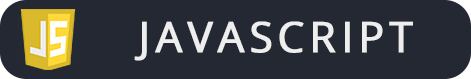
 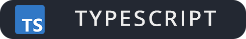 

## **:gear:Technologies**
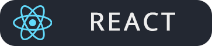 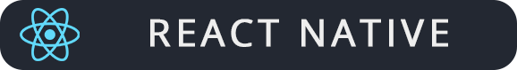     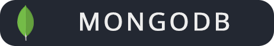 

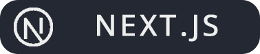 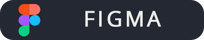  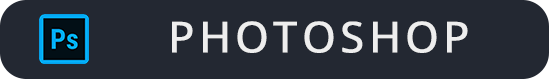  
## **:hammer:Projects**
 <a href="https://github.com/FabienD0/To-Do-List">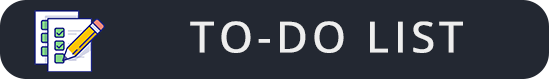</a>  

 <a href="https://github.com/FabienD0/Pokemon-World">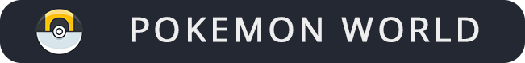</a> <a href="https://github.com/FabienD0/Calculator">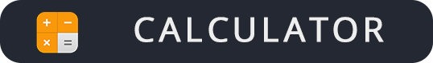</a>

## **:chart:GitHub Stats**

